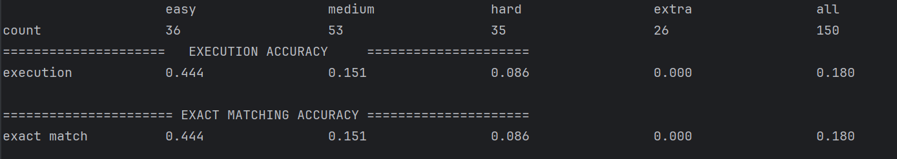
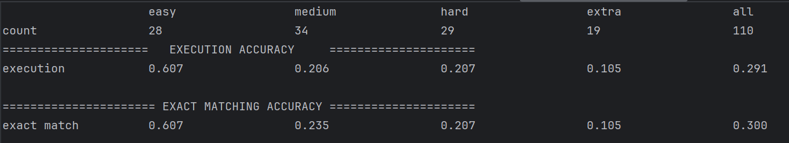
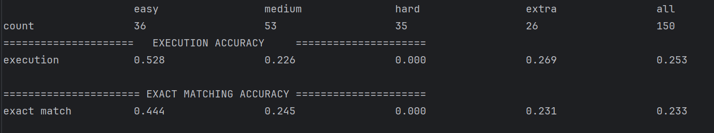

## links

Spider链接：
* [taoyds/spider: scripts and baselines for Spider: Yale complex and cross-domain semantic parsing and text-to-SQL challenge](https://github.com/taoyds/spider)
* [Spider: Yale Semantic Parsing and Text-to-SQL Challenge](https://yale-lily.github.io//spider)
* spider的简单概括：[Text-to-SQL学习整理（八）Spider数据集介绍导语 前面的一系列博客中，我们已经了解到Text2SQL任务的 - 掘金](https://juejin.cn/post/7085557671528660999)
* spider的数据集大小说明：[Spider数据集论文研读 - 阿帆fann - 博客园](https://www.cnblogs.com/tyfann/p/15727093.html)

相关论文：
* Spider ：[[1809.08887] Spider: A Large-Scale Human-Labeled Dataset for Complex and Cross-Domain Semantic Parsing and Text-to-SQL Task](https://arxiv.org/abs/1809.08887)
* [Can LLM already serve as a database interface? a big bench for large-scale database grounded text-to-SQLs | Proceedings of the 37th International Conference on Neural Information Processing Systems](https://dl.acm.org/doi/10.5555/3666122.3667957)

Spider2.0原文：Notably, methods based on GPT-4 achieved execution accuracy of 91.2% and 73.0% on the classic benchmarks Spider 1.0 (Yu et al., 2018) and BIRD (Li et al., 2024b), respectively.

## Spider1.0

### setup
1. input : Spider1.0数据集的测试文件test.json ,  以及对应的database schema文件test_tables.json
2. output : 生成的sql文件 "test_predict_1.0.txt" ，llm的生成结果和代价的记录文件test_predict_1.0.jsonl
3. llm setup 
* model = "gpt-4o-mini"， “gpt-4-turbo” , 智谱的"glm-4-plus"
* temperature = 0.0
* 测试数目：150条

### prompt
只包括简单的task description， question，database schema（直接采用spider数据集提供的json格式schema） and description
``` python
llm_string = """  
Let's think step by step.You are an expert in sqls.\  
Please generate the corresponding SQLite sql for the following question based on the provided database schema information and schema description, and provide a brief explanation.\  
question : {question}\  
database schema : {schema}\  
database schema description : {description}  
Answer the following information: {format_instructions}  """  
  
prompt_template = ChatPromptTemplate.from_template(llm_string)  
  
response_schemas = [  
    ResponseSchema(type="string", name="sql", description='The sql answer to the question.'),  
    ResponseSchema(type="string", name="explanation", description='Explain the basis for the sql answer.')  
]
```

### results
"gpt-4o-mini"


"gpt-4-turbo"


智谱的"glm-4-plus"



* 直接使用上面这种prompt，database schema信息较长，很容易超过问题的上下文限制（8000+，4000+）
* 各难度测试样例的平均execution success 比例，最佳情况下也只有30%左右