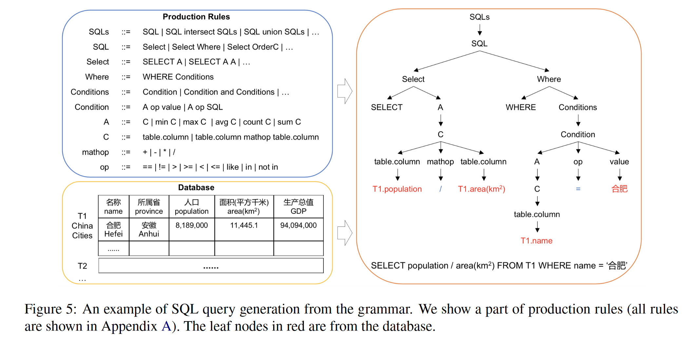
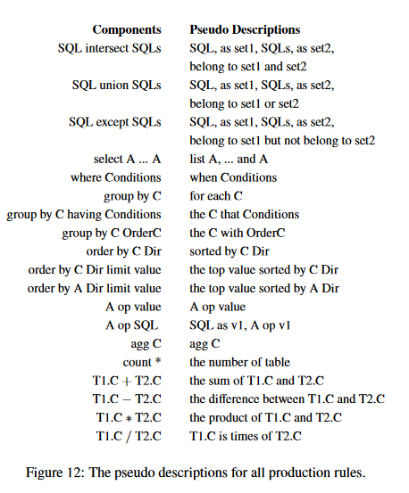

# characteristics
* Cross-domain
* Cross-lingual
# links
[DuSQL: A Large-Scale and Pragmatic Chinese Text-to-SQL Dataset](https://aclanthology.org/2020.emnlp-main.562.pdf)

论文里给的github链接（404了）release our data at https://github.com/luge-ai/luge-ai/tree/master/semantic-parsing.
# 0 Abstract
1. DuSQL: Chinese dataset for the cross-domain text-toSQL task, containing 200 databases, 813 tables, and 23,797 question/SQL pairs
2. Three major characteristics of this dataset
* **Analyze true distribution of SQL queries in real-life needs**
* Contain a considerable proportion of SQL queries involving row or column calculations
* **A semi-automatic data construction framework via human-computer collaboration** 
# 3 Corpus Construction
buid dataset via **a human-computer collaboration way**, twe steps :  
* Automatically generate SQL queries paired with pseudo questions given a database
* Paraphrase pseudo questions to NL questions by humans

## 3.1 Database Creation
three steps:
1. table acquisition: collect websites to crawl tables to cover multiple domains
2. table merging: merge tables with the same schema to a new table with a new schema
3. foreign key creation: create foreign keys between two tables via entity linking
Finally, create 200 databases with 813 tables

## 3.2 Automatic Generation of SQL Queries(important)
* **SQL query tree** can be automatically generated from the grammar, for which we utilize **production rules from the grammar** to automatically generate SQL.
* We **prune the rule paths** in the generation according to the **difficulty and semantic correctness** of a SQL query.
### 3.2.1 SQL Tree Constructed Gased on Production Rules



* The SQL query can be represented as a tree using the production rules(shown in Figure 5, details in Appendix A). 
* By exercising every rule of the grammar, we can generate SQL queries covering patterns of different complexity.

Appendix A(Figure 9，production rules):
```
SQLs ::= SQL intersect SQLs | SQL union SQLs | SQL except SQLs | SQL 
SQL ::= Select | Select Where | Select GroupC | Select Where GroupC | Select OrderC | Select Where OrderC | Select from SQL, SQL 
Select ::= select A | select A A | select A A A | select A A A A 
Where ::= where Conditions 
GroupC ::= group by C | group by C having Conditions | group by C OrderC 
OrderC ::= order by C Dir | order by C Dir limit value | order A Dir limit value 
Dir ::= asc / desc 
Conditions ::= Condition | Condition and Conditions | Condition or Conditions 
Condition ::= A op value | A op SQL 
A ::= min C | max C | count C | sum C | avg C | C 
C ::= table.column | table.column1 mathop table.column2 | table1.column mathop table2.column 
mathop ::= + | - | * | / 
op ::= = | != | > | >= | < | <= | like | in | not in
```
### 3.2.2  Prune the Rule Paths
We consider(control) the **difficulty and semantic correctness** in the automatic SQL generation.
#### Difficulty
Make some restrictions based on analysis on real-life questions:
* Nested queries(嵌套查询数目) : a SQL query contains only one nested query
* No more than three conditions in a where clause
* No more than four answers in a select statement
* A SQL query has at most one math operation
* Most text values are from databases. (The text values in a SQL query are from the database to reduce the difficulty of SQL prediction. We plan to remove this restriction in the next release version of DuSQL)
#### Semantic Correctness
Abide by **preconditions of each clause and expression** in the generation. The full list of preconditions is shown in Appendix C.

* For the generation of SQL query with multiple SQLs, e.g., {SQLs ::=SQL union SQLs}: the columns in the select clause of the previous SQL match the columns in the select clause of the subsequent SQL, i.e., the columns of the two select clauses are the same or connected by foreign keys. 
* For the rule of generating GroupC: the C is generated from the rule of {C ::= table.column}, where the column can perform the clustering operation, that is to say, the table can be divided into several sub-tables according to the values of this column. 
* For the rule of {Condition ::= A op value}: op 2 {<, <=, >, >=, =, !=, like}. If op 2 {<, <=, >, >=}, A and value must be in the type of number or date. If op is like, A must be in text type. 
* For the rule of {Condition ::= A op SQL}: op 2 {<, <=, >, >=, =, !=, in, not in}. If op 2 {<, <=, >, >=, =, !=}, A and SQL must be in the type of number, and {>= min, <= max} are invalid. If op 2 {in, not in}, SQL must return a set. 
* For the rule of generating A: {avg C | sum C} require the C is in number type, {min C | max C} require the C is in number or date type, and {count C} requires the C is in text type.
* For the rule of {C ::= t1.column mathop t2.column}: the two columns are of the same type, either number or date. Then we have to make sure that the columns are comparable based on rules built by search log analysis. 
* For the rule of {C ::= t1.column1 mathop t1.column2}: the numerical units of these two columns can perform corresponding mathematical operations, e.g., CNY/per x person = CNY.

## 3.3 Semi-automatic Generation of Questions
* Generate **a pseudo question** to explain it
* Annotators paraphrase pseudo questions to NL questions without looking at databases and SQL queries
### 3.3.1 Generate a Pseudo Question


1. The entire pseudo question of the SQL query consists of **pseudo descriptions of all clauses** according to their execution orders
2. The pseudo description of a clause consists of pseudo descriptions of all its components(pseudo descriptions shown in Appendix D)
3. Intermediate variables are introduced to express sub-SQL queries

4. Appendix D Descriptions of SQL Components
* The descriptions for aggregators of {min, max, count, sum, avg} are {minimum, maximum, the number of, total, average}. 
* The descriptions for operators of {=, !=, >, >=, <, <=, like, in, not in} are based on the column type. The descriptions for {=, !=, like, in, not in} with the text type are {is, is not, contain, in, not in}, descriptions for {=, !=, >, >=, <, <=} with the number type are {is equal to, is not equal to, more than, no less than, less than, no more than}, and descriptions for {=, !=, >, >=, <, <=} with the date type are {in, not in, after, in or after, before, in or before}. 
* The descriptions for math operators of {+, -, *, / } are {sum, difference, product, times}. 
* The descriptions for the condition relations {and, or} are {and, or}. 
* The descriptions for {asc, desc} are {in the ascending, in the descending}. 
* The descriptions for columns, tables, and values are equal to themselves.

5. Description for each production rule(Figure 12)



### 3.3.2 Paraphrase Pseudo Questions to NL Questions
Ask two annotators to reformulate pseudo questions into NL questions, and filter two kinds of questions:
* incomprehensible ones which are semantically unclear
* unnatural ones which are not the focus of humans

## 3.4 Review and Checking
Automatically detect low-quality question/SQL pairs according to the following evaluation metrics
1. Overlap (naturalness):  NL question with an overlap higher than 0.6 compared with the pseudo question
2. Similarity (enough information) :  train a similarity model based on question/SQL pairs. The question with a similarity score less than 0.8 is considered to be of low quality.

# 4 Notes
* 自动生成sql query和pseudo questions : 前者通过语法和约束解析得到AST，后者在AST的基础上结合descriptions for all components（sql components和NL description的一一对应）自动生成pseudo questions
* 自动生成的效果：原文的实验是在包括构建的DuSQL数据集在内的多个数据集上评估各种text-to-sql工具。对于生成sql和生成pseudo question的效果，文中并没有进行评估。
* NL question标注 ：是人工parapharse pseudo questions得到的
* 为什么这样设计：找sql expert进行了pseudo questions的翻译为nl question，感觉确实很多此一举。我真服了，结合一下 3.4 指定的两个指标，即要自然度又要信息充足不丢失，感觉就是为了为难annotators去反复改以符合要求，狡猾的资本家