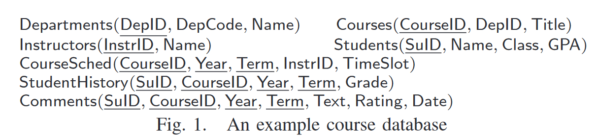
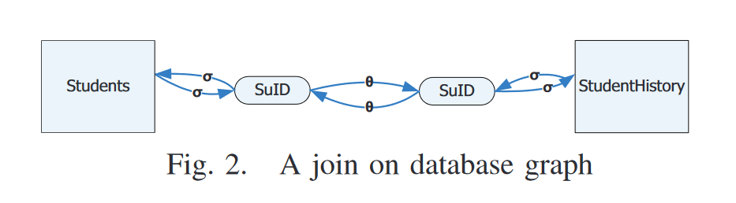
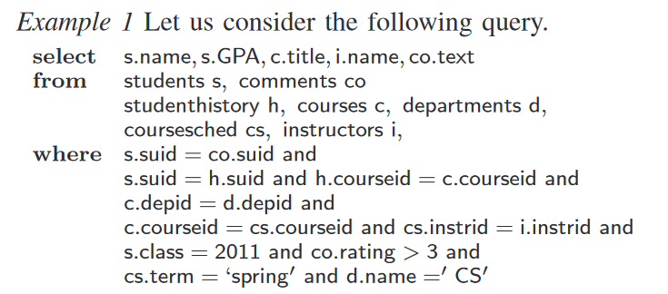
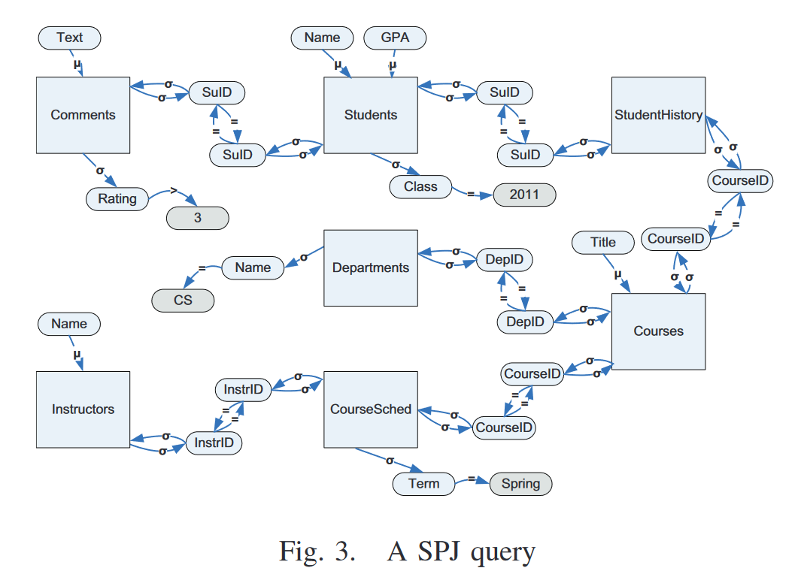
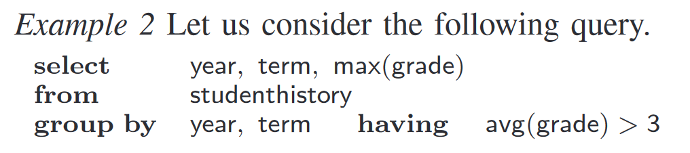
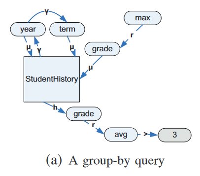
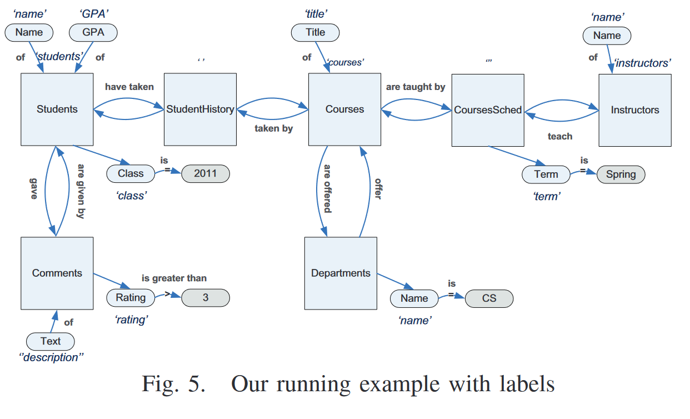
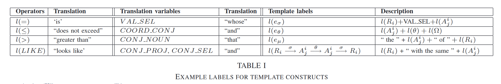

1. CoSQL原文对template-base的方法只做简单描述，并未给出源码或者参考的论文
2. [[1809.05255] SQL-to-Text Generation with Graph-to-Sequence Model](https://arxiv.org/abs/1809.05255)一文中提到"Earlier attempts for SQL-to-text task are rulebased and template-based (Koutrika et al., 2010; Ngonga Ngomo et al., 2013).", 两篇文章如下：
* [Explaining structured queries in natural language | IEEE Conference Publication | IEEE Xplore](https://ieeexplore.ieee.org/document/5447824)
* [Sorry, i don't speak SPARQL | Proceedings of the 22nd international conference on World Wide Web](https://dl.acm.org/doi/abs/10.1145/2488388.2488473)

# links
https://arxiv.org/abs/2208.10099

# 0 CoSQL: Template-based

1. Create a list of SQL query patterns without values, column and table names from SQL and NL response pairs in the training set : mask variable values to form SQL-response **templates** 
2. Manual mapping : manually changed the patterns and their corresponding responses to make sure that table, column, and value slots in the responses have one-to-one map to the slots in the SQL query
3. Match a new SQL quary with the templates :  A score will be computed to represent the similarity between the SQL and each template, which is based on the number of each SQL key components existing in the SQL and each template (原文描述为**rule-based approach** to select the closest SQL-response template pair)
4. Fill in the selected response template

# 1 Explaining Structured Queries in Natural Language

## 1.1 Task
Given a query q over a database D, we would like to generate a narrative that captures the intended meaning or objective of q.
## 1.2 Challenges
 1. Insufficient SQL semantics
 2. Complexity of the queries
 3. sql具有多种可替代的表述 ：**Several alternative expressions of a query in a formal language that are equivalent**
 4. 语义自然：Capture the query elements in the right order so that the corresponding textual expression is natural and meaningful independent of the way the user has expressed the query
## 1.3 Overview
1. A graph-based approach for **representing structured queries as directed graphs**
2. Annotate the graph elements with labels using **an extensible template mechanism**
3. Three translation strategies
* BST algorithm : the translation consists of a composition of clauses each one focusing on specific query semantics
* MRP algorithm : the translation is realized in a holistic manner, where information from all parts of the query graph is blended in the translation as we traverse the graph. 
* TMT algorithm : enables the use of predefined, richer, templates for query parts in an effort to produce more concise translations.
## 1.4 Query Graph Representation
### A Database Graph
符号解释如下：
1. D : a database comprises a set of relations
2. Ri : a relation with a set of attributes in database D
3. Aij(上下标) : an attribute of Ri
4. Database graph G(V, E) : a directed graph corresponding to the schema of D 

关于G(V,E)的点集V中点有 ：
1. R : relation nodes
2. A: attribute node

关于G(V,E)的边集E中边有 ：
1. membership edges, Eμ : connect an attribute node to its container relation node. 从属性点 Aij指向它的关系点Ri
2. selection edges, Eσ : connect each relation to each of its attributes. 这种边是为了体现select语句中关系relation和所选择的属性之间的联系，是双向的 
3. predicate edges(谓词边), Eθ : emanate from an attribute node and ending at another attribute node. 代表两个不同关系之间的join，以各自的属性作为作为join的共同属性

下面是一个例子，分别给出了database，表示两个relation之间join关系的G(V,E)图：

本文的方法以这种图的形式捕捉sql的语义

### B Query Graphs
符号解释如下：
1. q : SPJ Query q是指一种由 **选择（Selection, S）**、**投影（Projection, P）** 和 **连接（Join, J）** 这三种关系操作组成的关系查询
2. Gq (Vq , Eq) : a directed graph that is an extension of the database graph G(V,E)

关于Gq (Vq , Eq)的点集V中点有 ：
1. R : relation nodes
2. A: attribute node
3. value nodes : one for each value or a set of values

关于Gq (Vq , Eq)的边集E中边有 ：
1. membership edges, Eμ : connect an attribute node to its container relation node. 从属性点 Aij指向它的关系点Ri
2. predicate edges(谓词边), Eθ : 
* 形如 Aij θ Ω 的谓词构成了一个predicate edge，其中：Ω 可以是single value、a set of values，或者an attribute；θ 表示比较操作符（例如 =, <, >, <> 和 LIKE）
* 如果 Ω是single value、a set of values，则称为**选择谓词边**（selection predicate edge），记作 Aij →(θ) Ω（例如， Ω是single value的情况，"age=30"；Ω是a set of values的情况，"ageIN(20,25,30)"）
* 如果 Ω 是an attribute Akm，则称为**连接谓词边**（join predicate edge），记作Aij →(θ) Akm 以及Aij ←(θ‘) Akm，这是双向的边（例如，"salary>age"，如果 θ 为>，则θ’为<=）
3. selection edges, Eσ : 
* 形如 Aij θ Ω 的谓词，Aij和 Ω之间还包括selection edges
* 如果 Ω是single value、a set of values，则存在从其容器关系 Ri到 Aij的选择边（selection edges），记作Ri →(σ) Aij，单向的
* 如果 Ω 是an attribute Akm，则存在从其容器关系 Ri到 Aij的双向选择边（selection edges），记作Ri →(σ) Aij，和Ri  ← (σ) Aij

下面是一个例子，分别给出了sql及其Gq (Vq , Eq)图：

除了上面的内容，为了表示一些sql中的复杂查询结构（functions, expressions, and renaming operations as well as order-by, group-by and having clauses），文章用下面的edges和node types扩展了query graph：

1. function nodes:  represent a function, an expression or a renaming operation that is applied on an attribute Aij or a set of attributes
2. transformation edges，er: connect an attribute Aij with a function f that is applied to Aij. 链接attribute和运用在其上的function
* 如果 Aij 出现在`SELECT` 子句中，则表示为 Aij ←(r) f
- 如果 Aij 出现在`WHERE` 子句中，则表示为 Aij →(r) f  
3. order edges, eo: represent an ordering
* 如果查询结果按照属性 Aij,Akl,…排序，则定义一组排序边：第一条排序边从容器关系 Ri指向第一个排序属性 Aij，即Ri →(o) Aij；其余排序边按顺序依次连接每个排序属性，指向下一个排序属性，即 Aij →(o) Akl,…
4. grouping edges, eγ: represent a grouping
* 如果分组的属性依次为 Aij,Akl,…，则定义一组分组边：第一条分组边从容器关系 Ri 指向第一个分组属性 Aij、，即 Ri →(γ) Aij；剩余的分组边依次从当前属性指向下一个分组属性，即Aij →(γ) Akl,…
5. having edges, eh: show attributes in having clauses, 对于关系 Ri 中的每个参与属性 Aij，定义一条边 Ri →(h) Aij

上述添加的几条规则，其样例如下：

下面还考虑了queries with nesting。Given a query q (the “parent” query), each subquery block qm in q is represented as a separate query subgraph. This subgraph is treated as a “virtual” relation and it is connected to the parent graph **depending on its position as follows**:
太复杂了不想看，略

## 1.5 Capturing Query Semantics
a template mechanism to represent semantics of query graph elements
### A Labels
概念解释：
1. node v：query graph中的每个节点
2. label l of nodes, l(v) : the conceptual meaning of the node
3. relation node ：比如“Student”这个relation node，它代表一个实体类型(entity type)
4. function node：其conceptual meaning就是函数的输出，或者说是它实现的功能。例如，`max` 函数的conceptual meaning是“the greatest”
5. expressions or unknown functions：使用 default labels ，比如 “an expression on” or “a function of”
6. label of edges(path):  连接两个node的edge（或path）可以通过label进行annotate，来表示节点之间关系的自然语言含义，下面的图则显示了图3中的每条边的自然语义

上面的label即存在于database graph中，也存在于query graph中。label的提取如下：
* Node labels 的自动提取 ：extracte from the names of database constructs using schema matching and entity resolution techniques
* 人工提供fine-tuned labels：应该是设计师可以调整修改这些label

### B Templates
 下面介绍 template labels at different granularity levels 和 an extensible template mechanism to fuse these labels

1. A template label, l((v, u)) : is assigned to an edge (v, u) 
* Generic template label form:   l((v, u)) = expr1 + l(v)+expr2 + l(u)+expr3 
* expr1, expr2, expr3 is alphanumeric expressions ; the operator “+” acts as a concatenation operator
* Use or regist template labels : use a template language (based on [8]) 

2. generic templates
* defined on edges
* constructed automatically following the form ：l((v, u)) = expr1 + l(v)+expr2 + l(u)+expr3 
* database-agnostic: 与数据库无关的
* 确保template的extensibility：引入了template variables（见table I，展示了扩展时使用的默认值label），例如 Students →(σ) Name 的 l(eσ)为 “students whose name”

3. specific templates
* defined both on edges and paths
* created manually by a human（如存在，优先使用）
* Example: 对于自定义的模板 l(eσ(Students, Name)) = l(Students)+“ named ”，翻译结果为student named xxx

## 1.6 Query Translation
### A Query Subject

### B Query graph traversal

### C Template Selection

