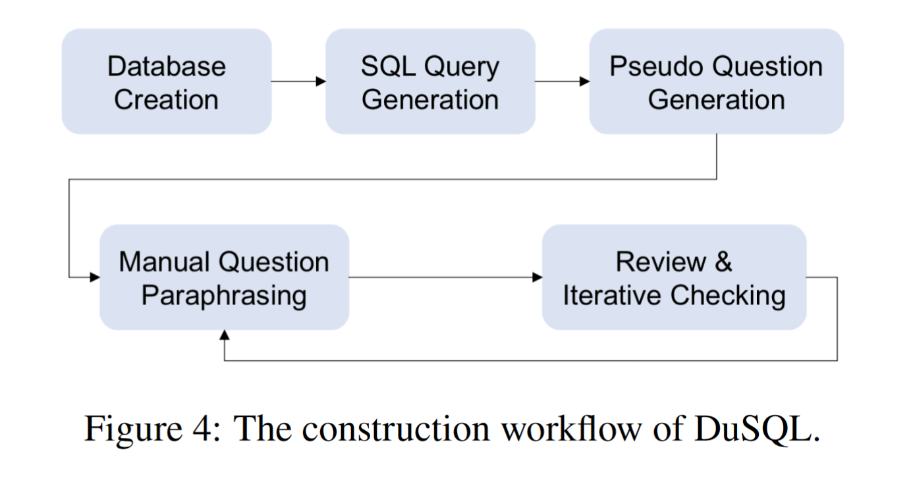
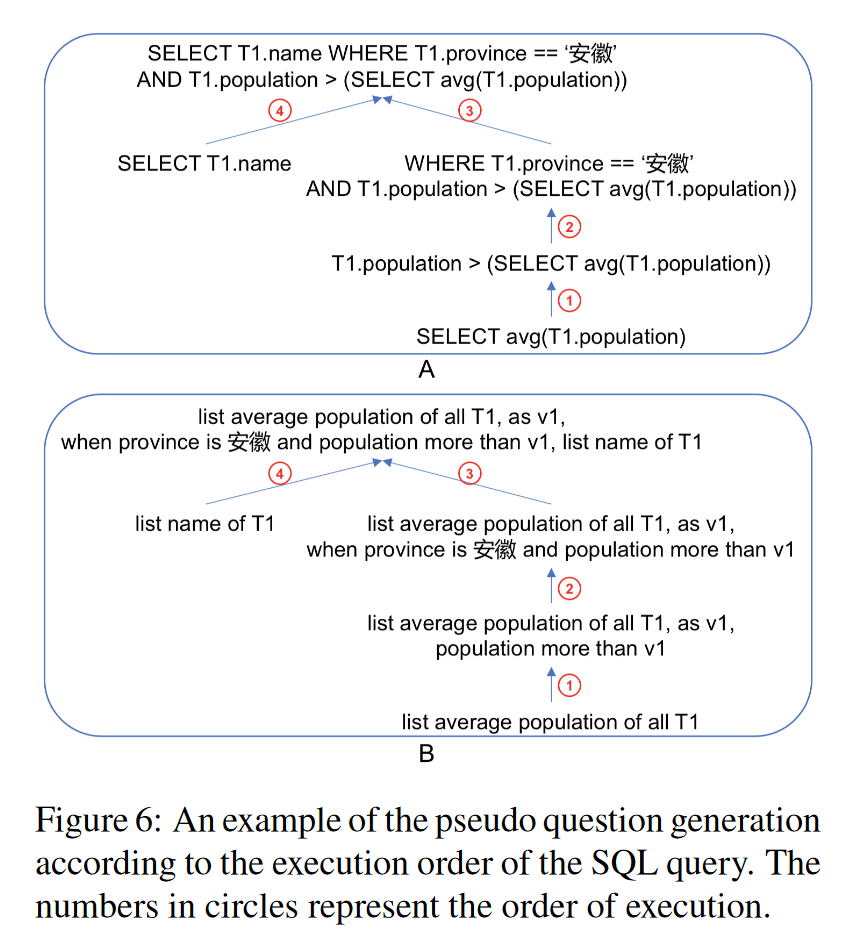
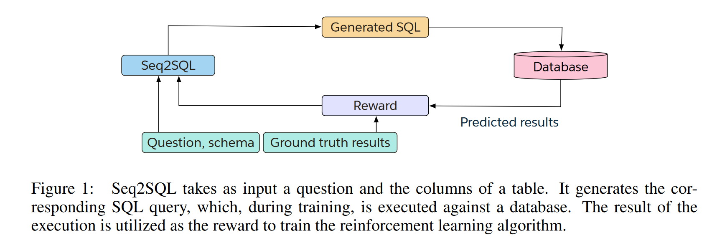
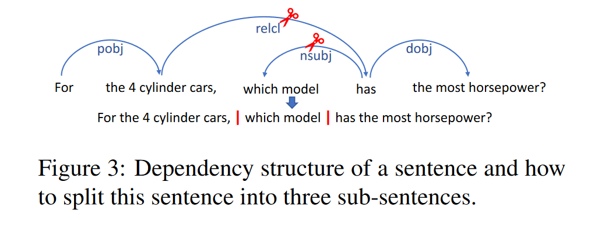
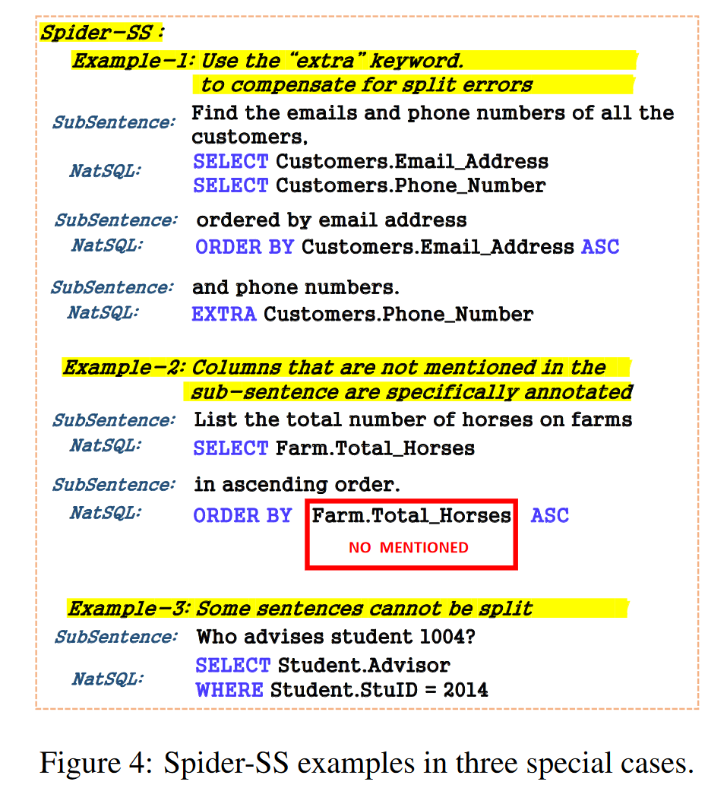
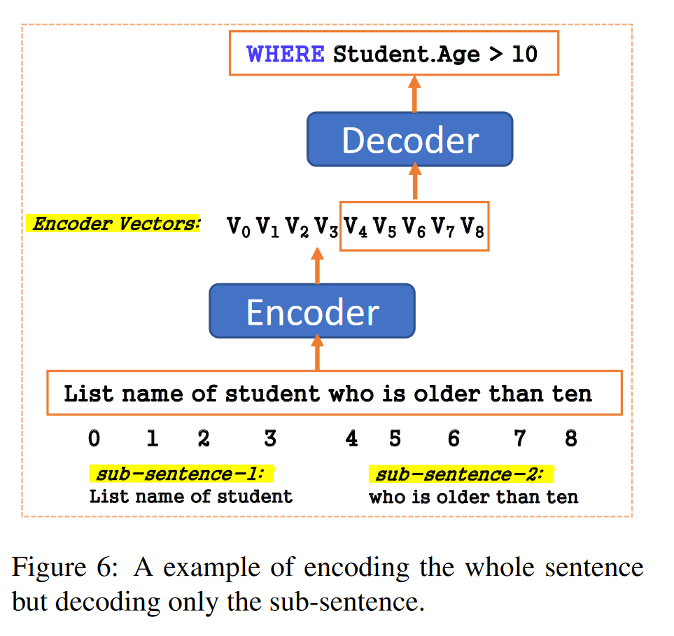
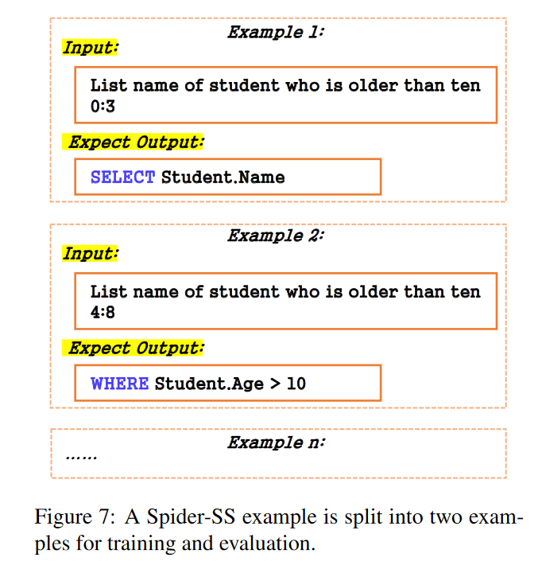

## 0 自动化/半自动化dataset生成工具

### 生成sql
[2 DuSQL](#2-dusql_a-large-scale-and-pragmaticchinese-text-to-sqldataset)
### 由sql生成nl question

[3_CoSQL](#3-cosql_a-conversational-text-to-sql-challenge-towards-cross-domain-natural-language-interfaces-to-databases)
### 由nl question生成sql

[5 WikiSQL](#5-seq2sql_generating-structured-queries-from-natural-language-using-reinforcement-learningwikisql)

[8 Spider-SS, Spider-CG](#8-measuring-and-improving-compositional-generalization-in-text-to-sql-via-component-alignmentspider-ssspider-cg)

## 1 BIRD
### characteristics
* Cross-domain
* Knowledge-augmented
### links
[2305.03111](https://arxiv.org/pdf/2305.03111)

[BIRD-SQL 论文速览 - 知乎](https://zhuanlan.zhihu.com/p/638719709)

[DAMO-ConvAI/bird at main · AlibabaResearch/DAMO-ConvAI](https://github.com/AlibabaResearch/DAMO-ConvAI/tree/main/bird)
### summary
1. 同时是Knowledge-augmented的
2. **纯人工标注的**
3. 首次提出VES

## 2 DuSQL_A Large Scale and Pragmatic Chinese Text to SQL Dataset
### characteristics
* Cross-domain
* Cross-lingual
### links
[DuSQL: A Large-Scale and Pragmatic Chinese Text-to-SQL Dataset](https://aclanthology.org/2020.emnlp-main.562.pdf)
### summary
1. Chinese dataset for the cross-domain text-toSQL task, containing 200 databases, 813 tables, and 23,797 question/SQL pairs
2. Three major characteristics of this dataset
* **Analyze true distribution of SQL queries in real-life needs**
* Contain a considerable proportion of SQL queries involving row or column calculations
* **A data construction framework via human-computer collaboration**
### DuSQL: a semi-automatic data construction framework
1. Basic idea:  generate SQL queries based on the SQL grammar and constrained by the given database.  For each SQL query :
* automatically generate SQL queries paired with pseudo questions given a database
* pseudo questions are paraphrased to NL questions by humans.

2. Automatic Generation of SQL Queries
* Generate from the grammar: utilize production rules from the grammar
* Two aspects considered in the generation: difficulty and semantic correctness of a SQL query
3. Semi-automatic Generation of Questions
* parapharse pseudo questions to NL questions

4. tips
* sql query和pseudo questions都是自动生成的，前者通过语法和约束解析得到AST，后者在AST的基础上结合descriptions for all components（sql components和NL description的一一对应）自动生成pseudo questions
* NL question是人工parapharse pseudo questions得到的（这一步可否基于该标注好的数据集进行llm微调实现自动化？？，鉴于descriptions for all components是相对有限的且格式固定的，微调易获得较好效果）
* 查一下为什么这样设计
## 3 CoSQL_A Conversational Text to SQL Challenge Towards Cross Domain Natural Language Interfaces to Databases

### characteristics
* Cross-domain
* Context-dependent
### links
https://aclanthology.org/D19-1204.pdf

[CoSQL: - 知乎](https://zhuanlan.zhihu.com/p/685978269)
### summary
1. Conversational : 跨域通用数据库(DB)查询**对话系统**的语料库
2. Natural language response generation based on an executed SQL and its results: user question的自动生成，这篇使用了三个baseline methods，看起来是传统的nlp方法
* Template-based: SQL and NL response pairs in the training set -> masked variable values to form parallel SQL-response templates -> for a new SQL query, employ rule-based approach to select the closest SQL-response template pair -> fill in the selected response template
* Seq2Seq: a vanilla Seq2Seq model with attention
* Pointer-generator :  copy column or table names(pointer) from the input SQL query into the NL responses
### tips
1. 为给定sql query自动化生成nl questions
### 4 Spider: A Large-Scale Human-Labeled Dataset for Complex and Cross-Domain Semantic Parsing and Text-to-SQL Task
### characteristics
* Cross-domain
### links
https://aclanthology.org/D18-1425.pdf
### summary
1. 纯人工标注的:  ask eight computer science students proficient in SQL to create 20-50 natural questions and their SQL labels. We did not use any template or script to generate question and SQL queries. 

## 5 Seq2SQL_Generating Structured Queries from Natural Language using Reinforcement Learning(WikiSQL)

### characteristics
* Cross-domain
### links
https://arxiv.org/abs/1709.00103
### summary
* 提出一个深层神经网络模型，用于生成sql：该模型生成一系列sql，在数据库中执行，以获得奖励，通过奖励来学习生成sql的策略
* 模型利用sql结构来减小生成sql的空间，使生成问题更简单
* 发布了WikiSQL：有80654个样本，每个样本包含自然语言问题和人工标注的sql
* Seq2SQL的性能执行准确率从35.9%提高到59.4%，逻辑形式准确率从23.4%提高到48.3%

### tips
1. input: question, schema;  output: sql, execute results.  
2. 为给定的nl question自动生成sql

## 6 KaggleDBQA: Realistic Evaluation of Text-to-SQL Parsers
### characteristics
* Cross-domain
### links
https://aclanthology.org/2021.acl-long.176.pdf
### summary

1. KaggleDBQA : a new dataset and **evaluation setting** for text-to-SQL parsers
2. Questions
* 人工标注的
* 问题更不 experted , 尽量不那么专业，more reflective of natural user interests

## 7 Towards Robustness of Text-to-SQL Models Against Natural and Realistic Adversarial Table Perturbation (ADVETA)
### characteristics
* Cross-domain
* Robustness
### links
https://aclanthology.org/2022.acl-long.142.pdf
### summary
1. ADVETA: **the first robustness evaluation benchmark** featuring natural and realistic ATPs(Adversarial Table Perturbation)
2. 基于三个主流的Text-to-SQL数据集——Spider（Yu等，2018）、WikiSQL（Zhong等，2017）和WTQ（Papernot等，2017）**手动构建**的
3. 人工标注的

## 8 Measuring and improving compositional generalization in text to SQL via component alignment(Spider-SS,Spider-CG)

### characteristics
* Cross-domain
* Context-dependent
### links
https://aclanthology.org/2022.findings-naacl.62.pdf

https://blog.csdn.net/Luo_LA/article/details/136864928
### summary
1. NLP compositional generalization is a major challenge: neural networks struggle with compositional generalization where training and test distributions differ
2. A clause-level compositional example generation method
3. Spider-SS: split the sentences in the Spider text-to-SQL dataset into subsentences, annotating each sub-sentence with its corresponding SQL clause   
4. Spider-CG : compose SpiderSS sub-sentences in different combinations,通过用其他样本中的sub-sentences**替换**该样本的 sub-sentences，或者**组合**两个sub-sentences以形成更复杂的样本

### Spider-SS
分割nl question并注释，收集所有NatSQL子句，然后生成NatSQL查询，NatSQL查询可以转换为SQL查询。
1. 句子分割算法 ：build our sentence split algorithm upon the NL dependency parser spaCy 2。将每个Spider句子分割成几个子句子（sub-sentences）。
2. 

2. 数据标注：用每个子句相对应的 SQL 子句对其进行注释。通过使用中间表示语言 NatSQL来降低此任务的难度，并且在语法上与自然语言 (NL) 更一致。

### Spider-CG

Spider-CG是一个合成数据集，是通过重新组合Spider-SS的子句生成的。重组方法有两种：
1. CG-SUB：不同示例之间的子句替换
2. CG-APP：将子句附加到另一个句子中

### Model
1. A modified seq2seq model : encode the whole sentence(为了take into account the context and the sub-sentence data of Spider-SS) but decode only the sub-sentence（得到NatSQL子句）

2. Three steps
* Data preprocess: Split the Spider-SS examples by sub-sentence
* Model modification: for two input data for a model, the first input is **an entire question** that directly goes to the encoder ; the second input is the sub-sentence indexes, which are used to select the encoder output. 
* Output combination: generate the final NatSQL query after the model outputting all NatSQL clauses

### tips
1. Spider-SS/CG: 为给定nl question生成sql，分割nl question生成NatSQL，再合并为NatSQL query

## 9 Exploring Underexplored Limitations of Cross-Domain Text-to-SQL Generalization(Spider-DK)
### characteristics
* Cross-domain
* Knowledge-augmented
### links
https://aclanthology.org/2021.emnlp-main.702.pdf
### summary
1. To investigate **the robustness of text-to-SQL models** when the questions require rarely observed domain knowledge
2. Introduce Spider-DK(domain knowledge) : a human-curated dataset based on the Spider benchmark for text-to-SQL translation.
* 选择原始数据集：从Spider数据集中选取一定数量的样本（包含SQL查询和表格结构）
* 扰动表格结构：列名扰动，表格内容扰动
* 生成SQL查询：SQL结构修改，保留语义

## 10 Towards Robustness of Text-to-SQL Models against Synonym Substitution(Spider-SYN)
### characteristics
* Cross-domain
* Robustness
### links
https://aclanthology.org/2021.acl-long.195.pdf
### summary
1. Investigate the robustness of text-to-SQL models to synonym substitution
2. Spider-Syn
* a human-curated dataset based on the Spider benchmark for text-toSQL translation
* NL questions: modified from Spider, by replacing their schema-related words with manually selected synonyms that reflect real-world question paraphrases
### Spider-SYN
1. NL questions: **manually modifying NL questions** in the Spider dataset using **synonym substitution**
### tips
1. 人工进行同义词替换标注的

## 11 Structure-grounded pretraining for text-to-SQL(Spider-Realistic)
### characteristics
* Cross-domain
* Robustness
### links
https://aclanthology.org/2021.naacl-main.105.pdf
### summary
1. 和Spider-DK的构建思路类似

## 12 A Pilot Study for Chinese SQL Semantic Parsing(CSpider)
### characteristics
* Cross-domain
* Cross-lingual
### links
https://aclanthology.org/D19-1377/
### summary
1. A first Chinese text-to-sql dataset : **Manually translate** the Spider (Yu et al., 2018b) dataset into Chinese, which is significantly more reliable compared to a dataset composed of machine-translated questions. 
### tips
1. 人工标注的
## 13 SParC: Cross-Domain Semantic Parsing in Context(SParC)
### characteristics
* Cross-domain
* Context-dependent
### links
https://aclanthology.org/P19-1443/

[SParC: Cross-Domain Semantic Parsing in Context 论文解读_数据集sparc-CSDN博客](https://blog.csdn.net/baidu_20163013/article/details/117187333)
### summary
1. SParC : a dataset for cross-domain Semantic Parsing in Context. 
* demonstrates complex contextual dependencies
* has greater semantic diversity
* requires generalization to new domains due to its cross-domain nature and the unseen databases at test time
2. nl question和纯人工编写

## 14 On the Potential of Lexico-logical Alignments for Semantic Parsing to SQL Queries(SQUALL)
### characteristics
* Knowledge-augmented
### links
https://aclanthology.org/2020.findings-emnlp.167.pdf
### summary
1. SQUALL
* to explore the utility of fine-grained, lexical-level supervision
* a dataset that enriches 11,276 WIKITABLEQUESTIONS English-language questions with **manually created** SQL equivalents plus alignments between SQL and question fragments

### tips
1. 纯人工标注的数据集
## Others
[GPT助教：文本到SQL转换 - 知乎](https://zhuanlan.zhihu.com/p/654135095)

[Text2SQL数据集和技术方案整理](https://www.zhihu.com/tardis/zm/art/683535421?source_id=1005)

